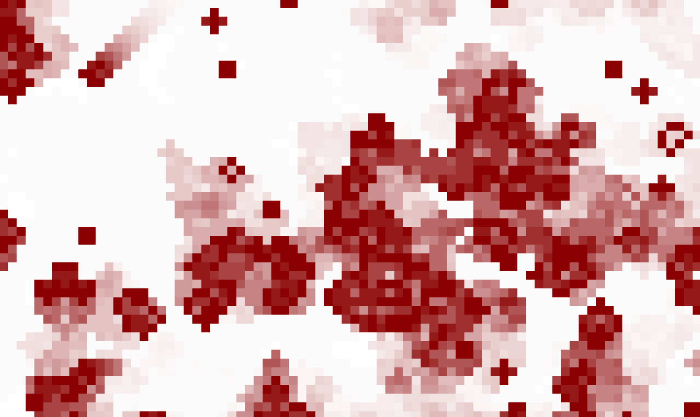

# Conway's Game of Life

---

This is a javascript implementation of [Conway's Game of Life](https://en.wikipedia.org/wiki/Conway%27s_Game_of_Life) using the [Phaser Game Engine](https://phaser.io/).

Minimal HTML and CSS. Parameters are easily configurable in the _config_ section of `app.js`.

### Configuration Parameters

* **screenWidth**: width, in pixels, of the game area
* **screenHeight**: height, in pixels, of the game area
* **cellXCount**: number of horizontal cells (more = tinier cells)
* **cellYCount**: number of vertical cells (more = tinier cells)
* **edgeCount**: number of cells to calculate beyond each edge of the game area
* **updatesPerMinute**: number of 'turns' per second
* **fadeRate**: how quickly cells 'fade away' after dying. Needs to be in the range 0-1, inclusive (no fade to immediate fade).
* **backgroundColor**: color of the empty game area;
* **cellColor**: color of living cells;
* **historyColor**: color of dead, fading cells;